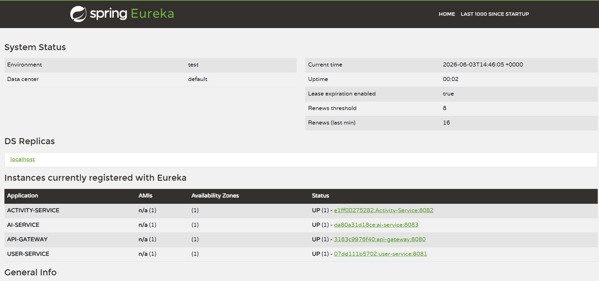
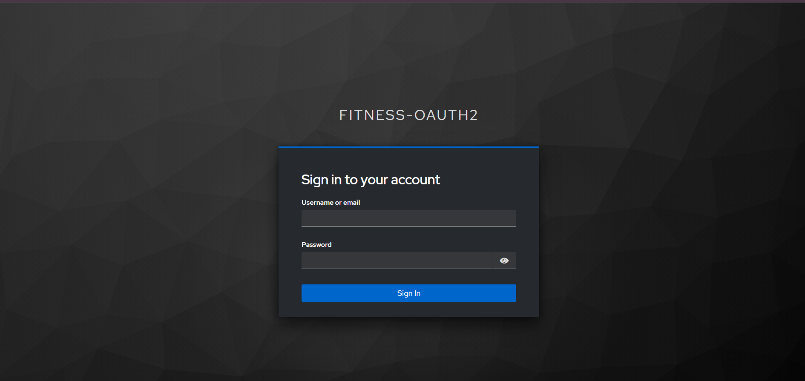
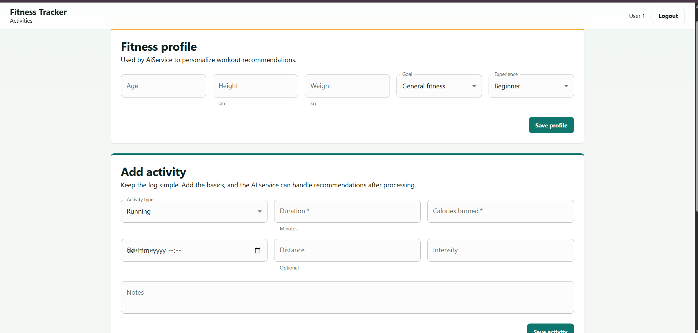
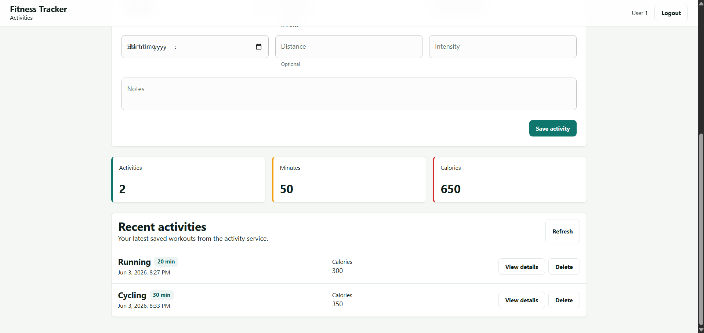
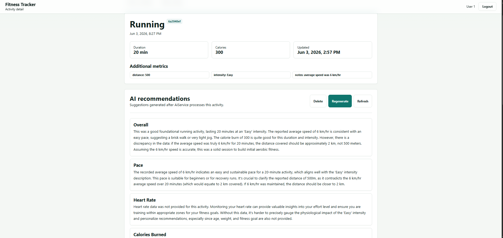
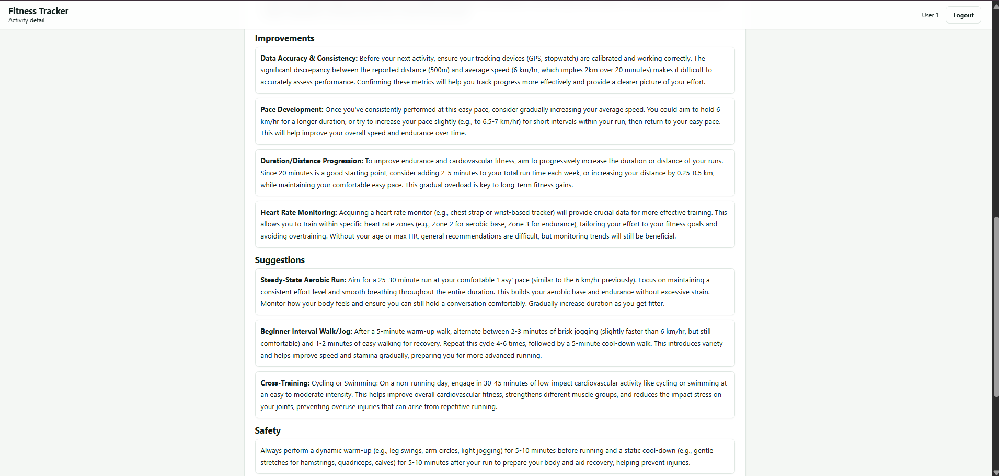
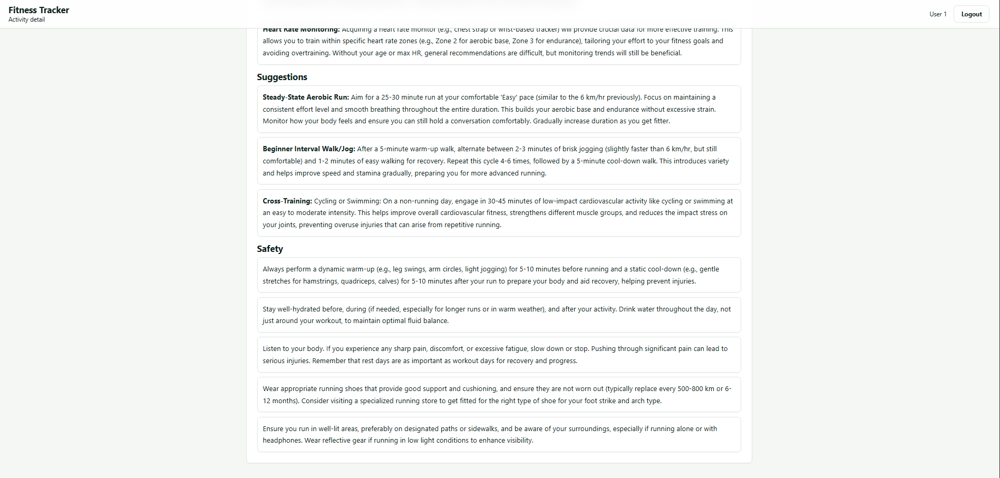

# Fitness App Microservices

A full-scale, event-driven, microservice architecture for a modern Fitness Application. This project demonstrates a production-grade backend ecosystem utilizing Spring Boot, Docker, OAuth2 (Keycloak), Message Brokers (RabbitMQ), and multiple database paradigms (PostgreSQL & MongoDB).

## Architecture Overview

This ecosystem is composed of 7 core backend services and a React frontend, orchestrated seamlessly using Docker Compose:

1. **API Gateway (Spring Cloud Gateway)**: The single entry point for all frontend traffic. Handles routing, load balancing, and edge-level configuration.
2. **Service Registry (Eureka)**: Dynamically registers and discovers all microservices in the network so they can communicate internally without hardcoded IPs.
3. **Config Server (Spring Cloud Config)**: Centralizes configuration management for all Spring Boot services, pulling `.yml` files dynamically at boot.
4. **Keycloak (Identity & Access Management)**: Handles OAuth2/OpenID Connect authentication, utilizing the PKCE flow for secure frontend login.
5. **User Service**: Manages user profiles and relational data. Backed by **PostgreSQL**.
6. **Activity Service**: Tracks fitness activities and workouts. Backed by **MongoDB** for flexible, document-based storage. Publishes events to RabbitMQ.
7. **AI Service**: Integrates with the **Google Gemini API** to generate personalized fitness recommendations based on user activity. Consumes events from RabbitMQ.
8. **Frontend**: A React application served via **Nginx**.

## Technology Stack

* **Backend Framework**: Java 21, Spring Boot 3, Spring Cloud
* **Frontend**: React, Vite, TailwindCSS
* **Databases**: PostgreSQL, MongoDB
* **Message Broker**: RabbitMQ
* **Security**: Keycloak (OAuth2, OIDC, PKCE)
* **Infrastructure**: Docker, Docker Compose

## Screenshots & Demonstration


*Service Registry showing all microservices online and communicating.*


*OAuth2 PKCE secure authentication flow.*


*Main dashboard for logging and tracking workouts.*


*Viewing recent logged activities.*


*Personalized AI fitness recommendations powered by Gemini.*


*Detailed AI feedback on workout consistency.*


*Actionable insights generated from user activity.*

[Insert link to screen recording or video demonstration here]

---

## Running the Project Locally

### Prerequisites

* Docker and Docker Compose installed on your local machine.
* A Gemini API key.

### 1. Setup Environment Variables

Create a `.env` file in the root directory and add your Google Gemini API key:
```env
GEMINI_API_URL=https://generativelanguage.googleapis.com/v1beta/models/gemini-1.5-flash:generateContent
GEMINI_API_KEY=your_gemini_api_key_here
```

### 2. Boot Up the Ecosystem

Open your terminal in the project root and run:
```bash
docker-compose up --build -d
```
*Note: The initial boot process may take several minutes as it compiles the Java applications, builds the React frontend, and initializes the database and broker containers.*

### 3. Accessing the Services

Once all containers are healthy, the following services will be available:

* **React Frontend**: http://localhost
* **Eureka Discovery Dashboard**: http://localhost:8761
* **Keycloak Admin Console**: http://localhost:8181/admin (Login: admin / admin)
* **RabbitMQ Management**: http://localhost:15672 (Login: guest / guest)

### 4. Logging In

When you access the frontend, you will be redirected to the Keycloak login screen.
* **Username**: user1
* **Password**: password1

*(Note: The realm configuration is automatically imported from `realm-export.json` on boot. However, you may need to recreate the user in the Keycloak admin console if starting from a completely fresh database volume).*

---

## System Interactions

1. **Event-Driven AI**: When a user logs a new workout via the Activity Service, a message is published to the `activity.exchange` on RabbitMQ. The AI Service asynchronously consumes this event and generates a personalized fitness recommendation using the Gemini API.
2. **Dynamic Configuration**: At boot time, every microservice communicates with the Config Server (`config-server:8888`) to download its specific settings, database credentials, and RabbitMQ bindings before initializing.
3. **Resiliency**: Services are configured with `restart: on-failure` policies to handle race conditions typical in microservice ecosystems, ensuring the Config Server and databases are fully ready before dependent services initialize.
